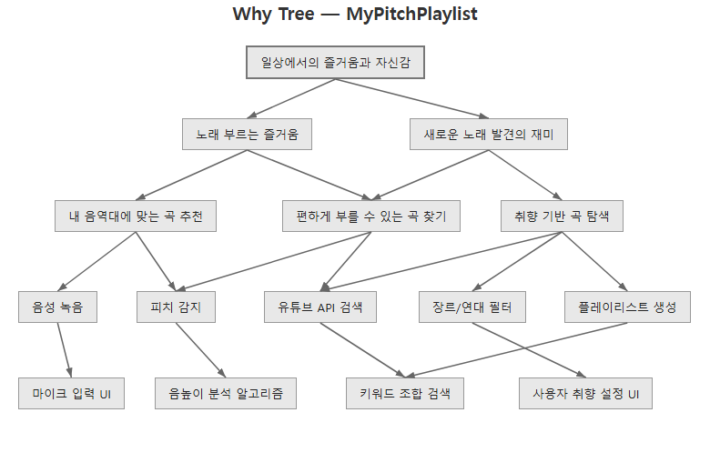

# Why Tree — Can I Eat?

아래에서 위로 올라가면 "왜?(Why Up)", 위에서 아래로 내려가면 "어떻게?(How Down)"

## 핵심 발견

최상위 목표에서 시작하여 아래로 내려갑니다. 각 단계에서 **"왜 중요한가?"** 또는 **"왜 그런가?"** 를 반복하여 더 이상 설명이 필요 없는 근본적인 믿음이나 제약에 도달할 때까지 계속합니다.

---

## 최상위 목표

**식이 제한이 있는 사람들이 세계 어디서든 자신이 먹을 수 있는 음식을 안전하게 파악할 수 있도록 돕는다.**

---

### 1단계 — 왜 중요한가?

- 식이 제한(비건, 알레르기, 종교적 이유, 질환 등)이 있는 사람들은 외국어로 된 성분표를 항상 읽고 이해할 수 없다
- 한국을 방문한 외국인과 거주 중인 외국인은 메뉴가 일부 번역되어 있어도 음식 안전성을 확인하는 데 어려움을 겪는다
- 한국의 관광객 수가 증가하고 있지만, 영어 번역은 종종 상세한 성분 정보를 누락한다

---

### 2단계 — 그것들이 왜 중요한가?

- **왜 성분표를 읽을 수 없는가?** 성분 목록은 복잡하고 전문적이며 현지 언어로 작성되어 있어, 기본 번역 앱으로는 식이 맥락을 파악하기 어렵다 (예: 한국에 거주 중인 인도인 비건 매니저는 제품에 숨겨진 동물성 성분이 포함되어 있는지 쉽게 알 수 없다)
- **왜 부분적인 메뉴 번역으로도 방문객이 어려움을 겪는가?** 관광객이 많은 지역에서는 음식 이름을 영어로 번역하지만, 전체 성분 정보는 거의 포함되지 않아 해외에서 방문한 친구들도 같은 문제를 겪는다
- **왜 관광 증가가 이 문제를 시급하게 만드는가?** 더 많은 외국인 방문객이 매일 낯선 식품 환경을 탐색해야 하며, 잘못된 판단은 실제 건강과 안전에 심각한 결과를 초래할 수 있다

---

### 3단계 — 근본적인 동기

- 음식 안전은 기본적인 권리이며, 언어 장벽이 건강을 위협해서는 안 된다
- 식이 요구는 문화적, 의학적, 윤리적으로 매우 개인적인 사안으로, 여행 중에도 타협할 수 없다
- 현재의 해결책인 파파고 복사 붙여넣기 후 성분별 구글 검색은 너무 느리고, 파편화되어 있으며, 실제 사용에는 신뢰하기 어렵다

---

## 참고 사항

_팀이 발견한 인사이트, 대안적 관점, 또는 예상치 못한 내용을 기록하세요._

| 인사이트 | 액션 |
|---|---|
| 번역은 음식 이름에서 멈추고 성분 정보까지 이어지지 않는다 — 관광객이 많은 지역에서도 동일한 문제가 존재한다 | 피치에서 이 격차를 강조할 것 |
| 인도인 비건 매니저 사례는 이 문제가 여행자뿐 아니라 거주 중인 외국인에게도 매일 발생함을 보여준다 | 거주 외국인을 핵심 페르소나로 포함할 것 |
| 해외에서 방문한 친구들도 독립적으로 동일한 불편함을 겪었다 — 문제의 보편성을 시사한다 | 시장 규모 근거 자료로 활용할 것 |
